# 00 Overview

> Draft v0.1  ·  last updated {{DATE}}

## Purpose
Provide a concise, high-level picture of **AIGYM's agentic school**—its learning goals, major subsystems, and how data flows among them. This doc is the "north star" that newcomers read first.

## 1. Agentic School Goals
1. Continually up-skill AI agents from *Beginner* to *Professional* across multiple domains.  
2. Blend automated critics with human teachers for rich feedback.  
3. Store experience in two memory layers—Episodic (raw) & Semantic (abstract)—to enable reflection and transfer-learning.

## 2. Core Components
| Label | Description |
|-------|-------------|
| **Planner** | Breaks a high-level goal into actionable tasks & orders them by dependency. |
| **Action Executor** | Runs individual steps (code, API calls, simulations) and streams logs. |
| **Critic Agent** | Autonomously evaluates outputs, assigns scores, explains failures. |
| **Human Teacher** | Provides nuanced feedback, explanations, and new challenges. |
| **Reflective Thinker** | Periodically analyses episodic logs to derive lessons & adjust strategy. |
| **Episodic Memory** | Immutable ledger of every message, action, score, and feedback. |
| **Semantic Memory** | Distilled knowledge graph + vector index built via concept extraction. |
| **Simulation Sandbox** | Safe environment for tasks (coding, writing, decision-making, etc.). |

## 3. High-Level Architecture

```mermaid
graph TD
  subgraph Human
    HT[👩‍🏫 Human Teacher]
  end

  subgraph Core
    P[🗺️ Planner]
    E[🤖 Executor]
    C[🧪 Critic]
    R[🪞 Reflective Thinker]
  end

  subgraph Memories
    EM[(📜 Episodic)]
    SM[(🧠 Semantic)]
  end

  subgraph Env
    S[🕹️ Simulation]
  end

  HT--Tasks & Feedback-->P
  P-->E
  E--Logs-->EM
  S--Results-->C
  C--Scores & Notes-->EM
  EM--Concept Extraction-->SM
  R--Insights-->SM
  C--Summaries-->R
  R--Adjust-->P
  E--Actions-->S
```

## 4. Basic Data Flow
1. **Task Assignment** – Human Teacher or curriculum engine feeds a goal to the **Planner**.
2. **Execution** – Planner delegates steps to **Executor**; outputs streamed to **Episodic Memory**.
3. **Evaluation** – **Critic** assesses results (using tests, rubrics, heuristics) and logs feedback.
4. **Human Feedback** – Teacher can add comments or overrides; also stored episodically.
5. **Reflection** – **Reflective Thinker** digests episodic logs, extracts concepts, and updates **Semantic Memory**.
6. **Curriculum Update** – Planner consults Semantic Memory + past scores to choose next tasks.

## 5. Memory System Intro
* **Episodic Memory** → PostgreSQL + pgvector, time-series-optimised; stores verbatim interactions.
* **Semantic Memory** → Neo4j + vector store; holds deduplicated concepts and relationships.

Together they form a feedback loop enabling the agent to *remember, reason, and improve*.

---
Next: see `01_curriculum_design.md` for learning stages and objectives. 