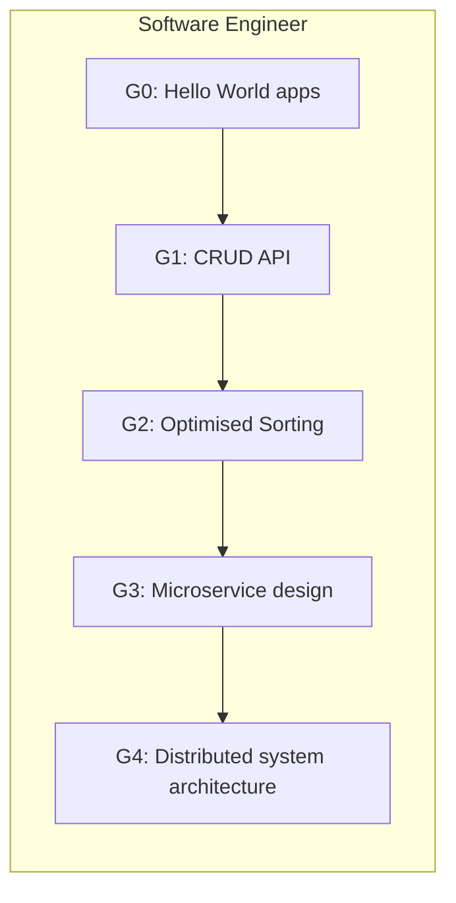

# 01 Curriculum Design

> Draft v0.1 · last updated {{DATE}}

## Purpose
Outline the **grade ladder**, learning objectives, and how each profession/domain maps onto the curriculum. This feeds the Planner's task selection and the evaluation rubrics.

## 1. Grade Definitions
| Grade | Name | Skill Band | Exit Criteria |
|-------|------|-----------|---------------|
| G0 | Novice | 0-20 % | Understands basic terminology; can follow guided examples. |
| G1 | Apprentice | 20-40 % | Completes simple tasks independently with minor errors. |
| G2 | Practitioner | 40-60 % | Handles moderate tasks; recognises common pitfalls; passes unit tests. |
| G3 | Advanced | 60-80 % | Optimises solutions, explains reasoning, minimal critic fixes. |
| G4 | Professional | 80-100 % | Solves open-ended problems, generalises to new contexts, teaches peers. |

*Percentages loosely correspond to rubric-based scoring across recent episodes.*

## 2. Core Learning Objectives per Grade
| Grade | Cognitive Focus | Behavioural Indicators |
|-------|-----------------|------------------------|
| G0 | Recall & Imitation | Copies patterns, relies on scaffolding, asks many clarifying questions. |
| G1 | Application | Executes tasks end-to-end, basic error handling, begins self-debugging. |
| G2 | Analysis | Compares multiple approaches, recognises anti-patterns, uses tools efficiently. |
| G3 | Synthesis | Integrates concepts across domains, optimises for constraints (time, space, style). |
| G4 | Evaluation & Creation | Generates novel solutions, critiques others, adapts to unfamiliar domains. |

## 3. Profession-to-Curriculum Mapping
Below table shows a **subset**; extend as needed.

| Profession | Key Concept Clusters | Entry Grade | Target Grade |
|------------|---------------------|------------|--------------|
| Software Engineer | Data structures, algorithms, tooling, testing, system design | G0 | G4 |
| Data Analyst | SQL, statistics, data visualisation, hypothesis testing | G0 | G3 |
| Technical Writer | Structure, audience analysis, clarity, style guides | G1 | G3 |
| Product Manager | User research, prioritisation, roadmap planning, stakeholder comms | G1 | G3 |

## 4. Curriculum Matrix (Excerpt)


## 5. Adaptive Progression Logic (pseudo)
```python
# Inputs: recent_scores (deque), target_grade
score = sum(recent_scores)/len(recent_scores)
if score > 0.8 and grade < target_grade:
    grade += 1  # promote
elif score < 0.4 and grade > 0:
    grade -= 1  # remediate
```

## 6. Next Steps
1. Flesh out full matrix for each profession with ~10 tasks per grade.  
2. Encode tasks in `simulation/task_specs/*.yaml`.  
3. Align critic rubrics to grade-level indicators.

---
See `02_episodic_memory.md` for how task performance is recorded. 