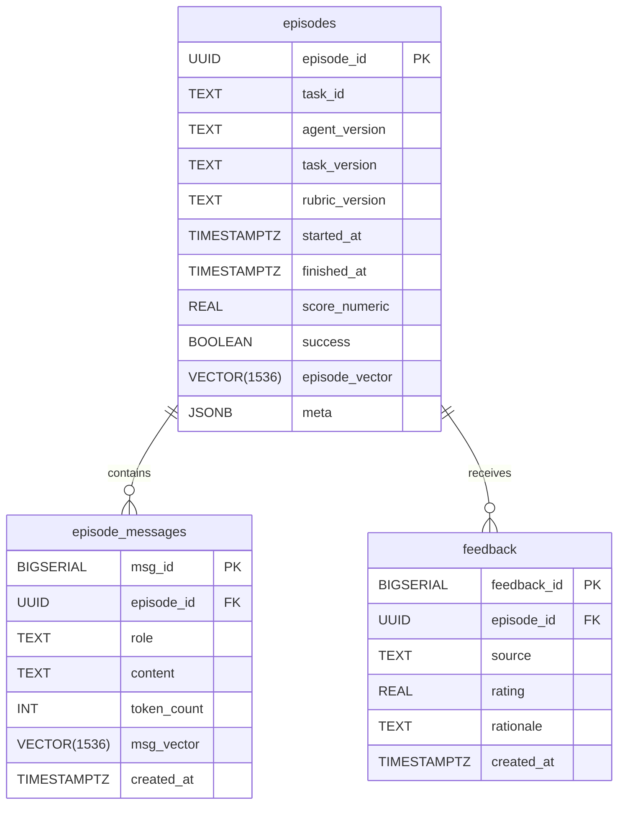

# 02 Episodic Memory

> Draft v0.1 · last updated {{DATE}}

## Purpose
Specify the **episodic memory** store that captures *every* interaction: tasks, agent messages, critic scores, human feedback. Serves as the factual ground-truth for reflection, analytics, and replay.

## 1. Data Model (PostgreSQL + pgvector)


DDL excerpt (see migrations):
```sql
CREATE EXTENSION IF NOT EXISTS pgvector;

CREATE TABLE episodes (
  episode_id       UUID PRIMARY KEY DEFAULT gen_random_uuid(),
  task_id          TEXT NOT NULL,
  agent_version    TEXT,
  task_version     TEXT,
  rubric_version   TEXT,
  started_at       TIMESTAMPTZ NOT NULL DEFAULT now(),
  finished_at      TIMESTAMPTZ,
  score_numeric    REAL,
  success          BOOLEAN,
  episode_vector   VECTOR(1536),
  meta             JSONB
);

CREATE TABLE episode_messages (
  msg_id           BIGSERIAL PRIMARY KEY,
  episode_id       UUID REFERENCES episodes ON DELETE CASCADE,
  role             TEXT CHECK (role IN ('planner','executor','critic','human')),
  content          TEXT,
  token_count      INT,
  msg_vector       VECTOR(1536),
  created_at       TIMESTAMPTZ DEFAULT now()
);
```

## 2. API Snippets
### Python (asyncpg)
```python
async def log_message(pool, episode_id, role, content):
    vec = await embed_async(content)
    async with pool.acquire() as conn:
        await conn.execute(
            """INSERT INTO episode_messages
               (episode_id, role, content, token_count, msg_vector)
               VALUES ($1,$2,$3,$4,$5)""",
            episode_id, role, content, token_len(content), vec
        )

async def similar_episodes(pool, query, k=10):
    q_vec = await embed_async(query)
    return await pool.fetch(
        """SELECT episode_id, score_numeric
             FROM episodes
         ORDER BY episode_vector <-> $1
            LIMIT $2""",
        q_vec, k)
```

### REST Endpoints (FastAPI)
| Method | Path | Purpose |
|--------|------|---------|
| POST | `/episodes/` | Create new episode record |
| POST | `/episodes/{id}/messages` | Append message |
| GET | `/episodes/{id}` | Fetch episode w/ messages & feedback |
| GET | `/search/episodes` | ANN similarity search |

## 3. Integration Hooks
1. **LLM Callbacks** – Instruments Executor to log prompts/responses in real-time.  
2. **Critic Reports** – `POST /episodes/{id}/feedback` with source=`critic`.  
3. **Human UI** – Teacher portal hits same endpoint with source=`human`.

## 4. Failure Loop Example
1. Critic marks `success=false`, rating=0.2.  
2. Reflective Thinker queries similar past failures.  
3. Generates improvement plan for Planner.

## 5. Retention & Maintenance
| Aspect | Strategy |
|--------|----------|
| Storage growth | TimescaleDB compression on `episode_messages`. |
| PII removal | Periodic scrub pipeline with regex + hashing. |
| Backups | Daily WAL archiving to S3. |

---
Next: `03_semantic_memory.md` dives into abstraction & reasoning. 