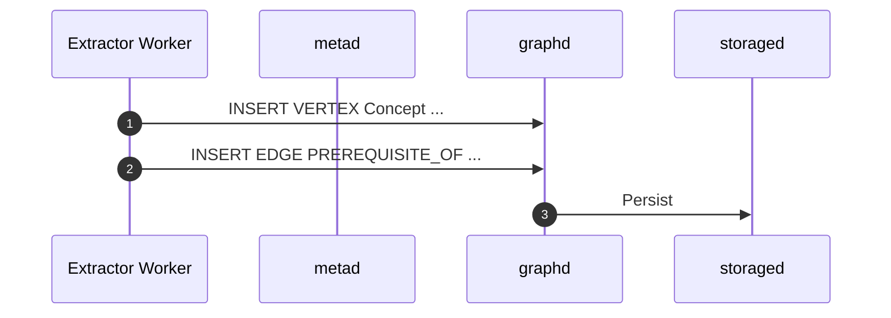

# 03 Semantic Memory

> Draft v0.1 · last updated {{DATE}}

## Purpose
Define the **semantic memory** layer that distils episodic logs into reusable knowledge: concepts, relationships, and embeddings. Enables higher-level reasoning, curriculum planning, and rapid retrieval.

## 1. Storage Strategy
| Layer | Tech | Why |
|-------|------|-----|
| Graph | **NebulaGraph OSS** (distributed LP-graph) | Horizontal scalability, Apache-2 licence |
| Vector | **Infinity (infiniflow/infinity)** *or* pgvector | Blazing-fast hybrid search incl. tensor & sparse |

Hybrid = graph stores relationships; vector store keeps dense embeddings. Nodes are linked via stable `concept_id` (UUID).

## 2. Graph Schema
```nGQL
CREATE SPACE IF NOT EXISTS aigym(vid_type=FIXED_STRING(36));
USE aigym;

-- Tags (node types)
CREATE TAG IF NOT EXISTS Concept(name string, type string, description string, created_at timestamp);

-- Edge types (relationships)
CREATE EDGE IF NOT EXISTS PREREQUISITE_OF(confidence float);
CREATE EDGE IF NOT EXISTS PART_OF();
CREATE EDGE IF NOT EXISTS CAUSES();
```

## 3. Vector Table
```sql
CREATE TABLE concept_vectors (
  concept_id UUID PRIMARY KEY,
  embedding  VECTOR(1536)
);
CREATE INDEX concept_ann ON concept_vectors USING ivfflat (embedding);
```

## 4. Upsert Flow


## 5. Retrieval APIs
### Python wrapper (nebula3-driver + Infinity client)
```python
from nebula3.gclient.net import ConnectionPool
from nebula3.Config import Config
from infinity_python_client import Infinity

# Initialise Infinity
infinity = Infinity(host="infinity", port=8000)

cfg = Config()
cfg.max_connection_pool_size = 10
nebula_pool = ConnectionPool()
nebula_pool.init([("nebula-graphd", 9669)], cfg)

def vector_search(query_text, k=5):
    ids = infinity.search(collection="concept_vectors", query=query_text, topk=k)
    with nebula_pool.session_context("root", "password") as sess:
        id_str = ','.join(f'\"{i}\"' for i in ids)
        res = sess.execute(f"MATCH (v:Concept) WHERE id(v) IN [{id_str}] RETURN v")
        return [row[0].as_node() for row in res]
```

## 6. Use-Case Examples
1. **Lesson Planning** – Query prerequisites of an upcoming concept to generate preparatory tasks.  
2. **Analogy Generation** – Retrieve *CAUSES* or *PART_OF* chains to craft analogies in explanations.  
3. **Error Remediation** – On critic failure, vector-search nearest concepts; fetch episodes teaching them.

## 7. Maintenance
| Task | Frequency | Tool |
|------|-----------|------|
| Node deduplication | Weekly | Levenshtein + manual review |
| Confidence decay | Monthly | Reduce relation confidence if unused |
| Backup | Daily | Neo4j dump + pg_basebackup |

---
For prompt & extraction specifics, see `03_concept_extraction.md`. 

For more nGQL vs Cypher tips, see Appendix A. 