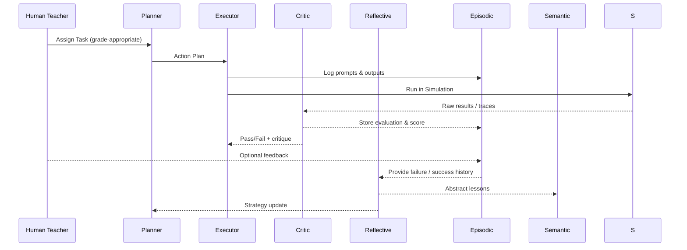

# 04 Learning & Feedback Loop

> Draft v0.1 · last updated {{DATE}}

## Purpose
Document the **end-to-end learning cycle** connecting AI agents, critic, human teachers, and the memory layers.

## 1. Sequence Diagram


## 2. Critic Evaluation Stages
| Stage | Checks | Tools |
|-------|--------|-------|
| Syntax | Compiles / executes? | linters, unit tests |
| Semantics | Meets spec? correct output? | reference solutions |
| Style | Readability, best practices | lint rules |
| Performance | Time / memory limits | benchmark harness |
| Explanation | Agent rationale quality | LLM rubric |

Each stage emits a sub-score; final score is weighted sum.

## 3. Reflective Thinker Algorithm (sketch)
```python
for episode in last_n_failures():
    sims = episodic.similar_episodes(episode.problem)
    concepts = semantic.vector_search(episode.problem)
    root_causes = analyse(sims, concepts)
    planner.queue_remediation(root_causes)
```

## 4. Human-in-the-Loop Touch-points
1. **Before task** – teacher can set custom constraints.  
2. **After critic** – teacher can override scores or add qualitative notes.  
3. **Periodic review** – teacher browses reflecting reports and approves curriculum jumps.

## 5. Feedback Data Contract
```json
{
  "episode_id": "uuid",
  "source": "human" | "critic",
  "rating": 0.0-1.0,
  "rationale": "text",
  "rubric_section": "performance" | "style" | ...
}
```

## 6. Adaptive Loop KPIs
| KPI | Target |
|-----|--------|
| Avg episodes to grade-up | < 50 |
| Critic vs human score delta | < 0.1 |
| Reflection runtime | < 2 min per 100 episodes |

---
Next: `05_simulation_environment.md` specifies the sandbox. 