# 05 Simulation Environment

> Draft v0.1 · last updated {{DATE}}

## Purpose
Describe the **sandbox** where agents practise and demonstrate competencies without real-world side-effects.

## 1. Supported Task Types
| Type | Examples | Tooling |
|------|----------|---------|
| Coding | Implement sorting algo, fix bug | Docker exec, unit tests |
| Data Analysis | Analyse CSV, plot trends | Python + pandas, Jupyter kernel |
| Writing | Draft blog post, technical doc | Markdown parser, style checker |
| Decision-Making | Choose marketing strategy | Simulation JSON state machine |

## 2. Architecture

```mermaid
graph LR
  subgraph Host
    API[🔌 Simulation API]
    Judge[⚖️ Task Judge]
  end
  Agent[🤖 AI Agent] --HTTP--> API
  PeerAgents[🤝 Peer Chat] --ws--> API
  API --> Docker[🐳 Container Pool]
  API --> Judge
```


* Each task runs inside an **ephemeral Docker container** with limited CPU/RAM.
* **Judge** loads `task_spec.yaml`, executes tests, returns PASS/FAIL + metrics.
* Peer discussion (optional) via WebSocket channel recorded in episodic memory.

## 3. Task Spec Template
```yaml
task_id: sorting_001
category: coding
grade: G1
prompt: "Implement Bubble Sort in Python."
version: v1
rubric_version: v1.0
time_limit_sec: 120
memory_mb: 256
metric: runtime_ms
rubric:
  - description: "Output sorted array correct"
    weight: 0.6
  - description: "Time complexity O(n^2) acceptable"
    weight: 0.2
  - description: "Code follows PEP8"
    weight: 0.2
```

## 4. Success / Failure Metrics
| Metric | Collected By | Stored Where |
|--------|--------------|--------------|
| Pass/Fail | Judge | episodes.success |
| Runtime | Judge | episodes.meta.runtime_ms |
| Memory usage | cgroups | episodes.meta.mem_mb |
| Peer Feedback Score | LLM summariser | feedback.rating |

## 5. Peer Discussion Protocol (optional)
1. Agents join a **discussion room** before attempting task.  
2. Conversation is time-boxed (e.g., 2 min).  
3. Logs stored via `/episodes/{id}/messages` with role=`peer`.

## 6. Security & Isolation
* Network disabled inside containers unless whitelisted.  
* Read-only filesystem for task resources.  
* OOM & CPU hard-limits.

---
Next: `06_human_ai_interaction.md` covers teacher interactions. 