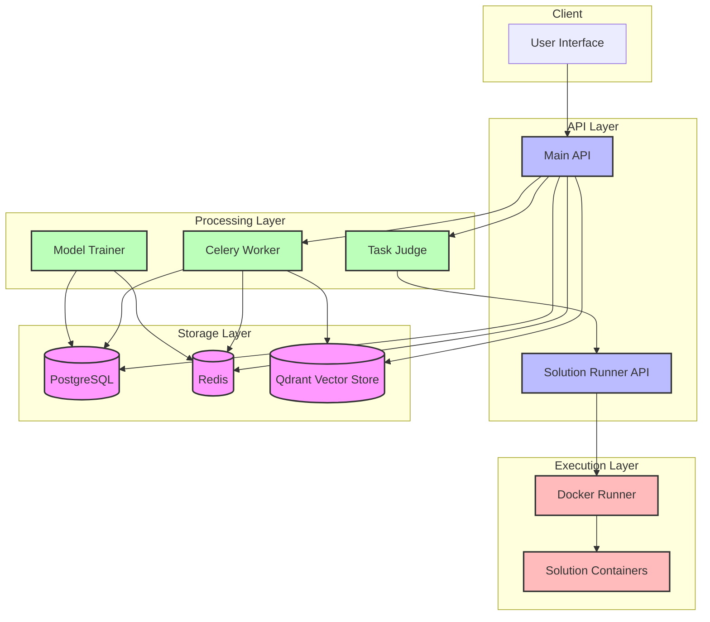
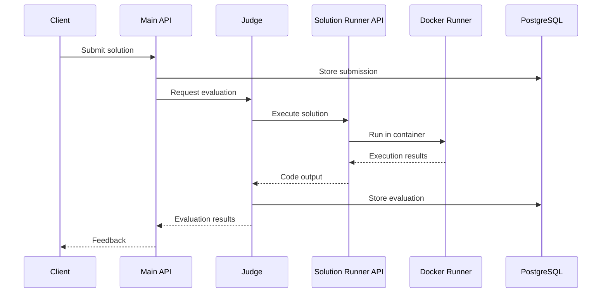
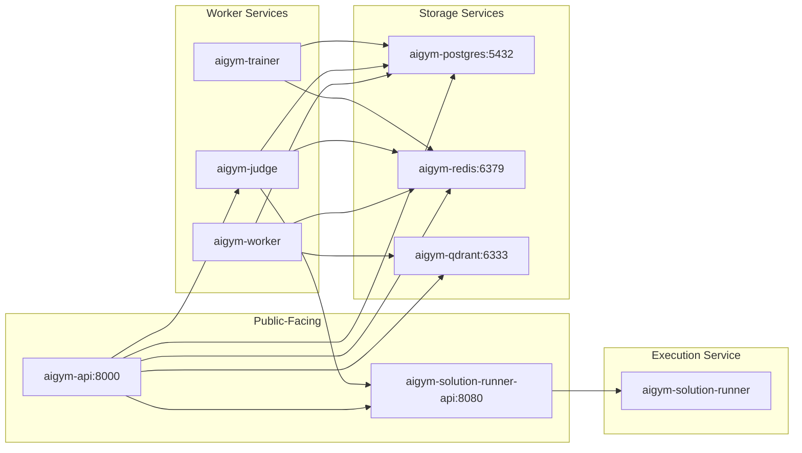
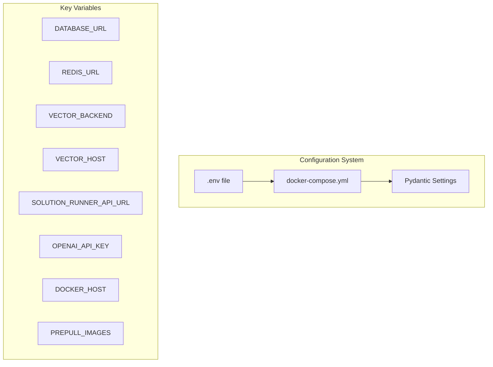
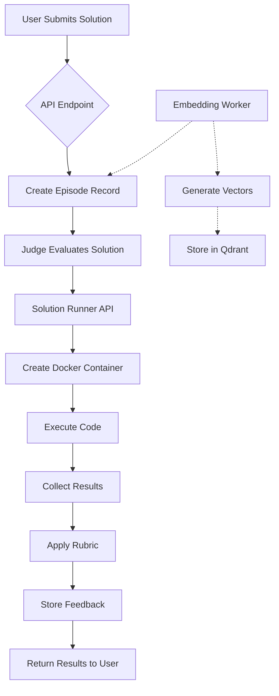
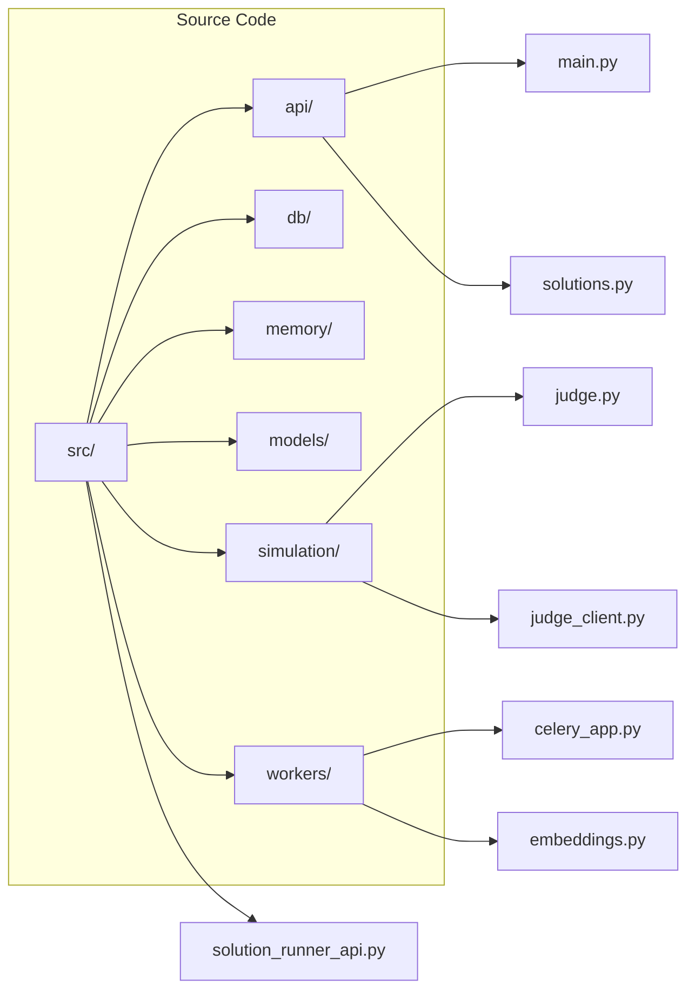

# AIGYM Codebase Documentation

## System Overview

AIGYM is a learning system for AI agents with a modular architecture designed for scalability and extensibility. The system enables AI agents to learn progressively through task execution, evaluation, and reflection.

## Architecture



## Component Details

### API Layer

#### Main API (`api/main.py`)
- **Purpose**: Main entry point for client interactions
- **Technologies**: FastAPI, Pydantic
- **Endpoints**:
  - `/episodes` - Managing learning episodes
  - `/solutions` - Submitting and evaluating code solutions
  - `/healthz` - Health check endpoint

#### Solution Runner API (`solution_runner_api.py`)
- **Purpose**: Isolates Docker operations for running code
- **Technologies**: FastAPI, Docker SDK
- **Endpoints**:
  - `/solutions` - Run code in isolated containers
  - `/health` - Docker connectivity check

### Processing Layer

#### Judge (`simulation/judge.py`)
- **Purpose**: Evaluates solutions against task rubrics
- **Technologies**: Pydantic for task specs, YAML for configuration
- **Functions**:
  - Task loading and parsing
  - Solution evaluation
  - Feedback generation

#### Celery Worker (`workers/celery_app.py`)
- **Purpose**: Handles asynchronous tasks
- **Technologies**: Celery, Redis
- **Tasks**:
  - Embedding generation
  - Background processing

#### Trainer (`workers/trainer_service.py`)
- **Purpose**: Manages model training and updates
- **Technologies**: HuggingFace, PyTorch
- **Functions**:
  - Model fine-tuning
  - Model serving

### Storage Layer

#### PostgreSQL Database
- **Purpose**: Primary data store for episodic memory
- **Schema**:
  - `episodes` - Learning interactions
  - `feedback` - Evaluation results
  - `solutions` - Submitted code/solutions

#### Redis
- **Purpose**: Task queue and caching
- **Usage**:
  - Celery broker
  - Temporary storage
  - Pub/sub messaging

#### Qdrant Vector Store
- **Purpose**: Semantic search via embeddings
- **Collections**:
  - `episodes` - Embedded episode content
  - `concepts` - Semantic concepts

### Execution Layer

#### Docker Runner (Docker-in-Docker)
- **Purpose**: Securely executes untrusted code
- **Technologies**: Docker, Docker-in-Docker (DinD)
- **Features**:
  - Resource limits
  - Network isolation
  - Multiple language support

## Data Flow



## Environment Configuration

### Docker Compose Services Network



## Key Environment Variables



## Technical Workflow



## Codebase Structure


```

When you save this file, you'll be able to view the Mermaid diagrams in any Markdown viewer that supports Mermaid (like GitHub, VS Code with appropriate extensions, or specialized Markdown editors).